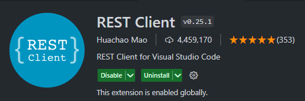
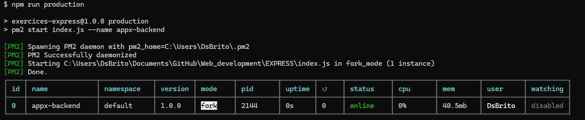

**EXPRESS**

## Initial Config

Before all, need install some node-modules dependences

```bash
npm i
```

For run the webservice, need use the `npm start`, something like this will appear in your terminal:

```bash
> exercices-express@1.0.0 start
> nodemon index.js

[nodemon] 3.1.0
[nodemon] to restart at any time, enter `rs`
[nodemon] watching path(s): *.*
[nodemon] watching extensions: js,mjs,cjs,json
[nodemon] starting `node index.js`
BACKEND RUNNING IN: 3000 PORT...

```

The webservice will run in the port 3000. I will test some GET/POST requests using the vscode extension "Rest Client", in the `request.http` file.

  <div align="center">
  
    
  </div>

If need use the webservice in production, we can use the `pm2`.

PM2 is a production process manager for Node.js applications with a built-in load balancer. It allows you to keep applications alive forever, to reload them without downtime and to facilitate common system admin tasks.

### Installing PM2

With NPM:

```bash
$ npm install pm2 -g
```

### Start an application

You can start any application (Node.js, Python, Ruby, binaries in $PATH...) like that:

```bash
$ pm2 start index.js --name appx-backend
```

Your app is now daemonized, monitored and kept alive forever.

### Managing Applications

Once applications are started you can manage them easily:

  <div align="center">
  
  </div>

To list all running applications:

```bash
$ pm2 list
```

Others commands:

```bash
$ pm2 show 0
$ pm2 restart 0
$ pm2 stop 0
$ pm2 kill
```

To have more details on a specific application:

```bash
$ pm2 describe <id|app_name>
```

To monitor logs, custom metrics, application information:

```bash
$ pm2 monit
```

#### Extra Links

Some links with guides about HTML:

- Pm2 Reference [here](https://www.npmjs.com/package/pm2)
- HTML Elements Reference [here](https://developer.mozilla.org/en-US/docs/Web/HTML/Element)

```bash
sudo npm i -g pm2
npm run production
pm2 monit
pmw
pm2 show 0
pm2 restart 0
pm2 stop 0
pm2 kill


```
