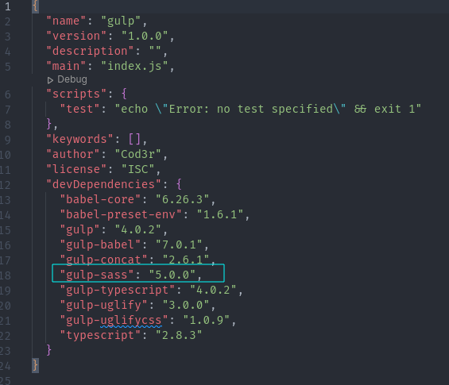
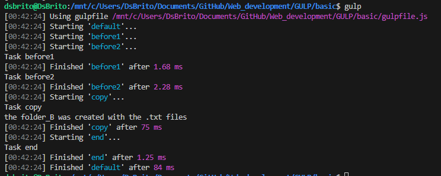
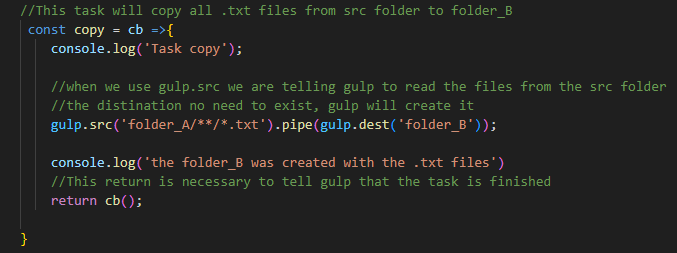

### Gulp

Gulp is a popular JavaScript task runner built on Node.js. It helps automate repetitive tasks in your development workflow, such as compiling Sass to CSS, minifying JavaScript files, optimizing images, and much more. Gulp uses a code-over-configuration approach, allowing developers to write tasks using JavaScript code instead of configuring them through external files. This makes it highly flexible and customizable for various project requirements. Gulp operates through a system of plugins, which are small Node.js modules that perform specific tasks, making it easy to extend its functionality. Overall, Gulp is widely used in web development to streamline the build process and improve productivity.

For use GULP need Update the file `pakage.json` to add "gulp-sass" dependency to version 5.0.0, leaving it in your file: "gulp-sass": "5.0.0".

  

    

  

- Install gulp

   - `sudo npm i -g gulp-cli`

- Execult gulp (need module.exports.default)
    - `gulp`

    

  

### Copy with gulp

    

  

<h3 align="justify">Extra links</h3>
    

    Some links with guide Gulp
    </a>
   

    Ajax Documentation ->
    <a href="https://gulpjs.com/docs/en/getting-started/quick-start"
       >here <-</a
    > 
