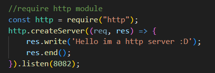
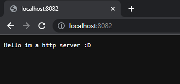

### Node.js

-   Description`: Node.js is the server-side (non-browser) javascript execution environment

  

  

  
    

-   Application: application written with javascript;

-   Interpretation: interpretation done by V8 (done in c language) + LIBUV (responsible for doing the asynchronous IO part);

<h3 align="left">Node Modules</h3>

-   Check node version:

    -   `node -v`

-   Install lodash:

    -   `npm i lodash`

-   install nodemon:
    -   `sudo npm i -g nodemon`

The nodemon is a tool that helps develop Node.js based applications by automatically restarting the node application when file changes in the directory are detected.

<h3 align="left">HTTP request</h3>

HTTP Messages - HTTP | MDN
HTTP requests are messages sent by the client to initiate an action on the server
  

  

  
    

  

  

  
    

<h3 align="left">Package JSON</h3>

-   Need use a command for create and define a package.json:
    -   `npm init`

  

  
    
  

-   Or use this command for reply yes to all questions and create a clean package.json:

    -   `npm init -y`

-   For install dependences (ex: axios)
    -   `npm i --save axios`
    

     
       
     

<h3 align="left">Extra links</h3>
    

    Some links about node
    </a>
      

      Nodemon ->
      <a href="https://www.npmjs.com/package/nodemon"
      >here <-</a
      
    </a>
      

      HTTP request ->
      <a href="https://developer.mozilla.org/pt-BR/docs/Web/HTTP/Methods"
      >here <-</a
      
    </a>
      

      npm scripts ->
      <a href="https://docs.npmjs.com/cli/v10/using-npm/scripts"
      >here <-</a
      
