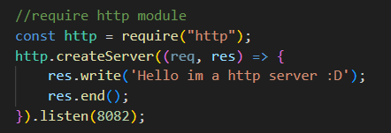
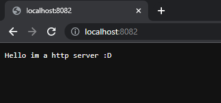
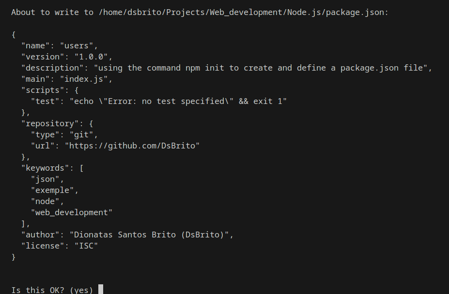
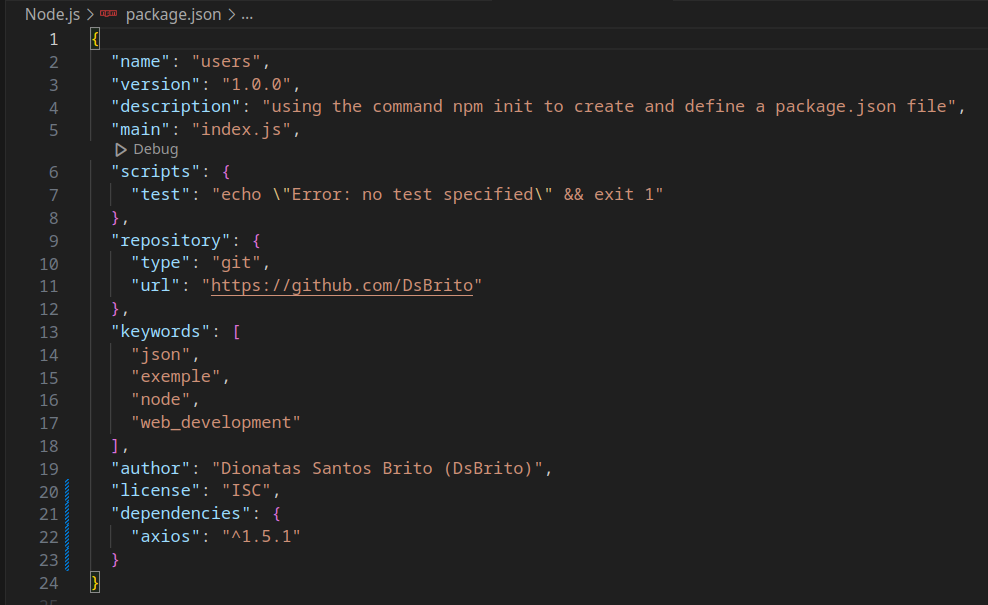
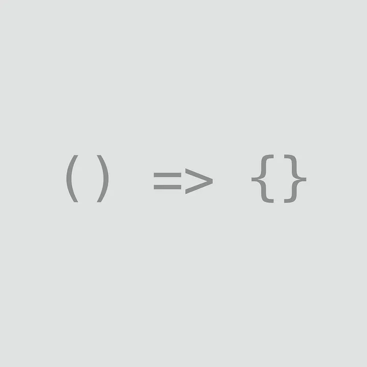

  # Web Development

  

    
    
  

  **Web development with JavaScript, Angular, React, Next, Vue, Node, HTML, CSS, jQuery, Bootstrap, Webpack, Gulp, and MySQL**

  ## Course Repository
  Somes exercises about web development [here ](https://github.com/cod3rcursos/web-moderno). 

  ## Help about Terminal
  - Linux/Mac [here](https://blog.cod3r.com.br/terminal-no-macos-e-linux/)
  - Windows [here](https://blog.cod3r.com.br/terminal-no-windows/)

  ## Browser Tools
  - Repl [here](https://replit.com/)
  - Jsfiddle [here](https://jsfiddle.net/)

  ---

  ### 1) Node.js
  

  
  

  - **Description**: Node.js is the server-side (non-browser) JavaScript execution environment.

  - **Application**: Application written with JavaScript.
  - **Interpretation**: Interpretation done by V8 (done in C language) + LIBUV (responsible for doing the asynchronous IO part).

  #### Node Modules

  - Check node version: `node -v`
  - Install lodash: `npm i lodash`
  - Install nodemon: `sudo npm i -g nodemon`

  Nodemon is a tool that helps develop Node.js based applications by automatically restarting the node application when file changes in the directory are detected.

  #### HTTP Request

  HTTP requests are messages sent by the client to initiate an action on the server.

  

    
    
  

  #### Package JSON

  Need use a command for create and define a package.json: `npm init`

  

    
      
  

  Or use this command for reply yes to all questions and create a clean package.json: `npm init -y`
  For install dependencies (ex: axios): `npm i --save axios`

  

    
  

  #### Extra Links

  Some links about node:
  - Nodemon [here](https://www.npmjs.com/package/nodemon)
  - HTTP request [here](https://developer.mozilla.org/pt-BR/docs/Web/HTTP/Methods)

  ---

  ### 2) ES NEXT

  

    
  

  #### What is ESNext JavaScript?

  ESNext JavaScript is a version of JavaScript that includes all of the language's latest features and updates. It is an evolution of ECMAScript, which is the standard on which JavaScript is based. ESNext is developed by the TC39 technical committee, which is responsible for defining the language specifications.

  #### Arrow Functions

  Arrow Functions are a more concise way of writing functions in JavaScript. They allow you to write functions more quickly and easily, using a simpler syntax and without the need to use the “function” keyword.

  #### Async/Await

  Async/Await is a simpler and more readable way of handling asynchronous operations in JavaScript. It allows you to write asynchronous code synchronously, which makes it easier to develop applications that depend on asynchronous calls, such as HTTP requests.

  #### Spread Operator

  The Spread Operator is an operator that allows you to spread the elements of an array or object into another array or object. It facilitates the manipulation and copying of arrays and objects, making the code more concise and readable.

  ---

  ### 3) JavaScript

  **Description**: JavaScript is a programming language used by developers to make interactive Internet pages.

  #### Setting

  Setting up a JavaScript Study Environment with Visual Studio Code and Node.js [here](https://blog.cod3r.com.br/configuracao-do-ambiente/)

  #### VsCode Extension
  

    
  

  #### Run

  Need to press Ctrl + Alt + N to run a .js program with Node or Ctrl + Alt + M to stop a .js program.

  

    
    
  

  #### Extra Links

  Some links with guides/exercises about JavaScript:
  - Web Docs Guide [here](https://developer.mozilla.org/pt-BR/docs/Web/JavaScript/Guide)
  - Exercises [here](https://edabit.com/challenges)
  - The 10 Best Coding Challenge Websites [here](https://medium.com/coderbyte/the-10-best-coding-challenge-websites-for-2018-12b57645b654)

  ---

  ### 4) HTML

  #### What is HTML?

  HTML is a markup language that defines the structure of your content. HTML consists of a series of elements, which you use to enclose, or wrap, different parts of the content to make it appear a certain way or act a certain way.

  #### Why use HTML?

  HTML is essential for structuring web content, providing a universal language understood by all browsers. Its simplicity and compatibility ensure seamless accessibility across devices, promoting inclusivity online.

  #### Extra Links

  Some links with guides about HTML:
  - HTML Element Reference [here](https://www.w3schools.com/tags/)
  - HTML Elements Reference [here](https://developer.mozilla.org/en-US/docs/Web/HTML/Element)

  ---

  ### 5) CSS

  #### What is CSS?

  Cascading Style Sheets (CSS) is a web development language that controls the appearance of elements on a webpage. It works hand-in-hand with markup languages like HTML or XML to define the visual style and formatting of those elements.

  #### How Does CSS Work with HTML?

  If HTML were the engine components of a car, CSS would be the body style and the paint job. CSS makes the front-end of a website shine and it creates a great user experience.

  #### Why Is CSS So Important?

  CSS is used to define styles for your web pages, including the design, layout, and variations in display for different devices and screen sizes. It's responsible for text style, size, positioning, color, and more on a website.

  #### Extra Links

  Some links with guides about CSS:
  - CSS Reference [here](https://devdocs.io/css/)
  - CSS Tutorial [here](https://www.w3schools.com/css/)
  - CSS Specifications [here](https://www.w3.org/Style/CSS/specs.en.html)

  ---

  ### 6) Ajax ~ Axios ~ Fetch

  #### What is Ajax?

  Ajax is a web development technique that allows you to update specific parts of a web page without having to reload the entire page.

  #### What is Axios?

  Axios is a promise-based HTTP Client for Node.js and the browser.

  #### What is Fetch?

  Fetch is a built-in web API in modern web browsers that provides an interface for making HTTP requests to servers.

  #### What is the difference between Ajax, Axios, and Fetch?

  Ajax is a technique for asynchronous communication in web development, while Axios and Fetch are libraries or APIs specifically designed for making HTTP requests. Axios provides a simple and elegant interface for making requests, while Fetch is a built-in web API that offers a more modern and flexible approach to fetching resources asynchronously.

  #### Extra Links

  Some links with guides about Ajax, Axios, Fetch:
  - Ajax Documentation [here](https://api.jquery.com/category/ajax/)
  - Axios Documentation [here](https://axios-http.com/docs/intro)
  - Fetch Documentation [here](https://developer.mozilla.org/en-US/docs/Web/API/Fetch_API/Using_Fetch)

  ---

  ### 7) Gulp

  Gulp is a popular JavaScript task runner built on Node.js. It helps automate repetitive tasks in your development workflow, such as compiling Sass to CSS, minifying JavaScript files, optimizing images, and much more. Gulp operates through a system of plugins, making it highly flexible and customizable for various project requirements.

  #### Babel

  Babel is a JavaScript compiler that allows developers to write code using the latest ECMAScript (JavaScript) syntax, while ensuring compatibility with older browsers and environments.

  #### TypeScript

  TypeScript is a programming language developed by Microsoft that adds static typing to JavaScript, helping developers detect programming errors at development time and offering advanced object-oriented programming features.

  #### SASS

Sass stands for "Syntactically Awesome Style Sheets." It is a preprocessor scripting language that is interpreted or compiled into Cascading Style Sheets (CSS). Sass provides features such as variables, nesting, mixins, functions, and more, which are not available in traditional CSS. These features make CSS authoring more efficient and maintainable, allowing developers to write cleaner and more organized stylesheets.

Here's a brief overview of some key features of Sass:

- **Variables**: Sass allows you to define variables to store reusable values such as colors, font sizes, or spacing values. This makes it easier to maintain consistency throughout your stylesheets and quickly update styles across your project.

- **Nesting**: Sass allows you to nest CSS rules within one another, which can help you write cleaner and more readable stylesheets by organizing related styles together.

- **Mixins**: Mixins are reusable blocks of styles that can be included in multiple CSS rules. They allow you to encapsulate common patterns and avoid repetitive code in your stylesheets.

- **Functions**: Sass provides built-in functions for tasks like color manipulation, mathematical operations, and more. These functions can help you dynamically generate styles based on input values.

- **Partials and Imports**: Sass allows you to break your stylesheets into smaller files called partials, which can be imported into other Sass files. This modular approach helps you organize your stylesheets and manage complexity in larger projects.

- **Control Directives**: Sass provides control directives like @if, @for, and @each, which allow you to add logic and loops to your stylesheets. This can be useful for generating repetitive styles or handling conditional styling based on certain criteria.

  #### Extra Links

  Some links with guides about Gulp, Babel, TypeScript, SASS:
  - Babel Compiler [here](https://babeljs.io)
  - TypeScript Documentation [here](https://www.typescriptlang.org/docs/handbook/typescript-in-5-minutes.html)
  - SASS Documentation [here](https://sass-lang.com/documentation/)

