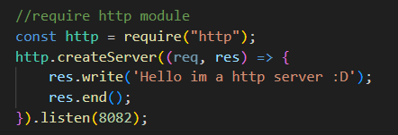
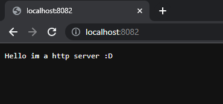
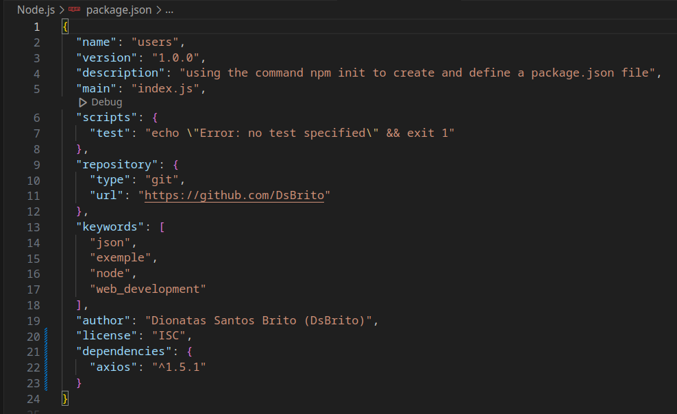

# WEB DEVELOPMENT

**Web development with Javascript, Angular, React, Next, Vue, Node, HTML, CSS, jQuery, Bootstrap, Webpack, Gulp and MySQL**

<h3 align="left">Course Repository</h3>
 </a>
 

  Somes exercices about web development
  <a href="https://github.com/cod3rcursos/web-moderno"
     >here <-</a
    

<h3 align="left">Help about Terminal</h3>
 </a>
 

  Linux/Mac ->
  <a href="https://blog.cod3r.com.br/terminal-no-macos-e-linux/"
     >here <-</a
    
 </a>
 

  Windows ->
  <a href="https://blog.cod3r.com.br/terminal-no-windows/"
     >here <-</a
    

 <h3 align="left">Browser Tools</h3>
 </a>
 

  Repl ->
  <a href="https://replit.com//"
     >here <-</a
    
 </a>
 

  Jsfiddle ->
  <a href="https://jsfiddle.net/"
     >here <-</a
    

---

### 1) JavaScript

Description: JavaScript is a programming language used by developers to make interactive Internet pages.

<h3 align="left">Setting</h3>
 </a>
    Setting up a JavaScript Study Environment with Visual Studio Code and NodeJS
    <a href="https://blog.cod3r.com.br/configuracao-do-ambiente/"
       >here <-</a
      

<h3 align="left">VsCode Extension</h3>
    

    

<h3 align="left">Run</h3>
    

    Need press Ctrl + Alt + N for run a  .js program with node or Ctrl + Alt + M for stop .js program
    

    
    

<h3 align="left">Extra links</h3>
    

    Some links with guide/exercises about javascript
    </a>
    

    Web docs Guilde ->
    <a href="https://developer.mozilla.org/pt-BR/docs/Web/JavaScript/Guide"
       >here <-</a
      
     </a>
     

      Exercises ->
      <a href="https://edabit.com/challenges"
         >here <-</a
        
     </a>
     

      The 10 Best Coding Challenge Websites ->
      <a href="https://medium.com/coderbyte/the-10-best-coding-challenge-websites-for-2018-12b57645b654"
         >here <-</a
        

---

### 1) Node.js

-   Description`: Node.js is the server-side (non-browser) javascript execution environment

  

  

  
    

-   Application: application written with javascript;

-   Interpretation: interpretation done by V8 (done in c language) + LIBUV (responsible for doing the asynchronous IO part);

<h3 align="left">Node Modules</h3>

-   Check node version:

    -   `node -v`

-   Install lodash:

    -   `npm i lodash`

-   install nodemon:
    -   `sudo npm i -g nodemon`

The nodemon is a tool that helps develop Node.js based applications by automatically restarting the node application when file changes in the directory are detected.

<h3 align="left">HTTP request</h3>

HTTP Messages - HTTP | MDN
HTTP requests are messages sent by the client to initiate an action on the server
  

  

  
    

  

  

  
    

<h3 align="left">Package JSON</h3>

-   Need use a command for create and define a package.json:
    -   `npm init`

  

  
    
  

-   Or use this command for reply yes to all questions and create a clean package.json:

    -   `npm init -y`

-   For install dependences (ex: axios)

    -   `npm i --save axios`

    

    
      
    

<h3 align="left">Extra links</h3>
    

    Some links about node
    </a>
      

      Nodemon ->
      <a href="https://www.npmjs.com/package/nodemon"
      >here <-</a
      
    </a>
      

      HTTP request ->
      <a href="https://developer.mozilla.org/pt-BR/docs/Web/HTTP/Methods"
      >here <-</a
      
